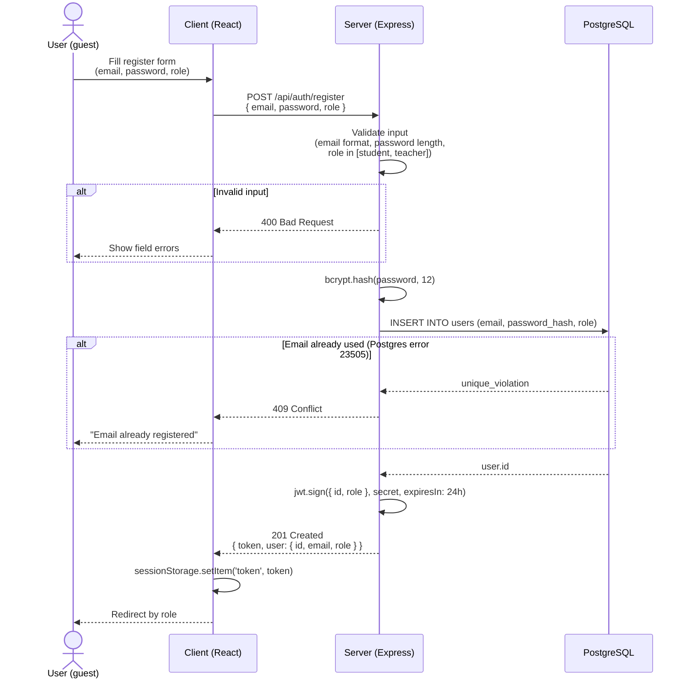
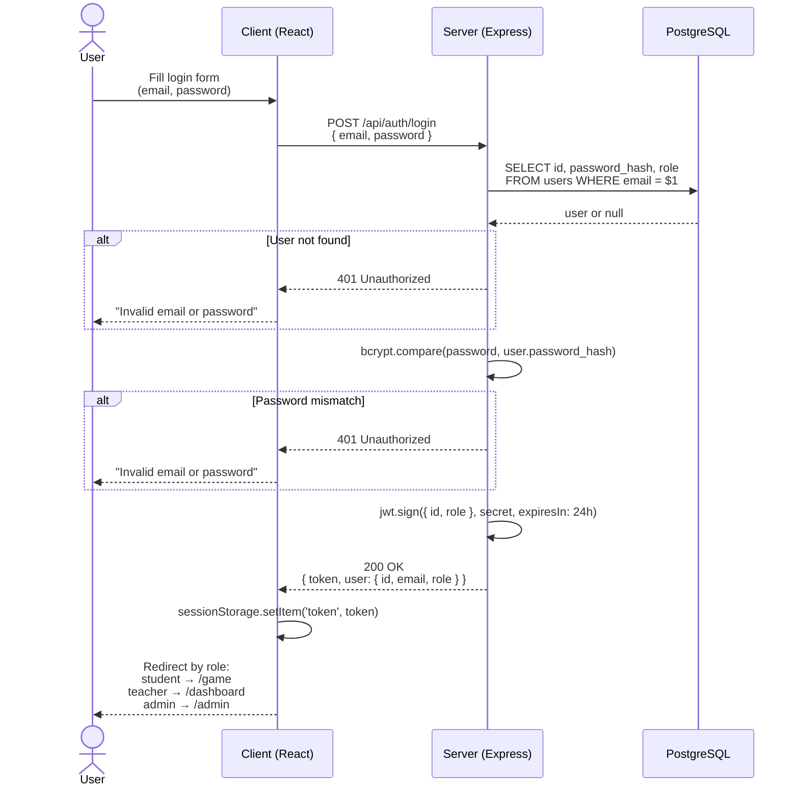

# CodeQuest — Authentication design

This document describes how auth works in CodeQuest: registration, login, and how protected routes check identity and role. It's the spec I'm coding from for phase 2.

## Design choices

This is a school project on an 11-week timeline, not a production banking app. The goal is code I can explain line by line.

- **One JWT, no refresh token.** Tokens are valid for 24 hours; when yours expires, you log in again. A refresh mechanism would be cleaner, but it brings real headaches: cookies across two deployment domains (Vercel on the front, Render on the back), rotation, server-side revocation. Not worth it for v1.
- **Access token stored in `sessionStorage` on the client.** Less safe than memory-only or httpOnly cookies XSS could read it but `sessionStorage` clears when the tab closes, which shrinks the theft window compared to `localStorage`. React escapes everything by default and I avoid `dangerouslySetInnerHTML`. Good enough for the MVP.
- **Bcrypt with 12 salt rounds.** Below 10 is too fast; above 14 noticeably slows registration. 12 is the usual sweet spot.
- **Role-based access via a middleware chain.** Every protected route runs `verifyToken` first to check identity, then `requireRole(...)` when a specific role is required. Two small middlewares, reusable everywhere.
- **At registration, role is restricted to `student` or `teacher`.** Admin accounts only come from the seed script. Letting anyone self-register as admin would obviously be a non-starter.

## Endpoints

| Method | Path | Auth | Description |
|---|---|---|---|
| POST | `/api/auth/register` | Public | Create a student or teacher account |
| POST | `/api/auth/login` | Public | Authenticate and get a JWT |
| GET | `/api/auth/me` | Bearer JWT | Return the currently logged-in user; used by the client to restore a session after a refresh |
| PATCH | `/api/auth/email` | Bearer JWT | Change own email; re-checks the current password first |
| PATCH | `/api/auth/password` | Bearer JWT | Change own password; re-checks the current password first |
| `*` | `/api/...` | Bearer JWT | Anything else, gated by `verifyToken` (and possibly `requireRole`) |

---

## 1. Registration

---

## 2. Login

Both cases unknown email and wrong password return the same 401 with the same message. Distinguishing them would let anyone enumerate which emails are registered on the platform.

---

## 3. Access to a protected route

---

## 4. Account self-service

Added after the initial phase-2 spec. Two routes let a logged-in user change their own credentials: `PATCH /api/auth/email` and `PATCH /api/auth/password`. Both sit behind `verifyToken`, and the user id always comes from the token (`req.user.id`), never from the body a user can only ever modify their own account.

The key constraint: both actions re-check the current password before applying the change. A JWT lives for 24 hours, so a borrowed or stolen session would otherwise be enough to take over an account by swapping its email or password. Requiring the current password closes that window. Validation rules (email format, password length, whitespace rejection) are the same as at registration, and a duplicate email still maps to a 409 via the same `23505` path. Email change returns `200 { user }`; password change returns `204` with no body, since the client keeps its still-valid token.

These 12 cases live in `tests/account.test.js`.

---

## Input hardening

Beyond the validation shown in the registration diagram, both endpoints apply the following protections before any database call:

- **Strict type checking.** Each field must be a string. Numbers, arrays, null, and missing fields all return 400 instead of crashing on `.length` or `.trim()`.
- **Email normalization.** Email is trimmed and lowercased on both register and login, so `Alice@X.com` and `alice@x.com` resolve to the same account.
- **Length bounds.** Email is capped at 254 characters (RFC 3696). Password is capped at 72 because bcrypt silently truncates beyond that rejecting longer passwords explicitly is clearer than letting them be partially ignored.
- **Whitespace-only password rejection.** `"        "` (8 spaces) passes the minimum length check but is caught as a separate case.
- **Race-condition-safe duplicate detection.** Rather than `SELECT-then-INSERT`, the controller relies on the `UNIQUE` constraint on `users.email` and catches Postgres error `23505` on insert. Under concurrent registrations, only one wins; the others get a clean 409.

Both controllers are wrapped in `try/catch`. Express 4 doesn't forward async rejections to the global error handler by default, so without it an unhandled promise rejection silently hangs the request.

---

## Error responses

| Status | When |
|---|---|
| `400 Bad Request` | Malformed input (bad email, missing field, invalid role) |
| `401 Unauthorized` | Wrong credentials, missing token, or expired token |
| `403 Forbidden` | Logged in, but the role can't access this resource |
| `409 Conflict` | Email already registered (registration only) |

## Not covered yet

Password reset, rate limiting on the login endpoint, and account lockout after repeated failures are all left out for now. They're easy to add later (`express-rate-limit` handles the last two in an afternoon). Email verification isn't planned for the MVP schools tend to manage registration through their own codes anyway.