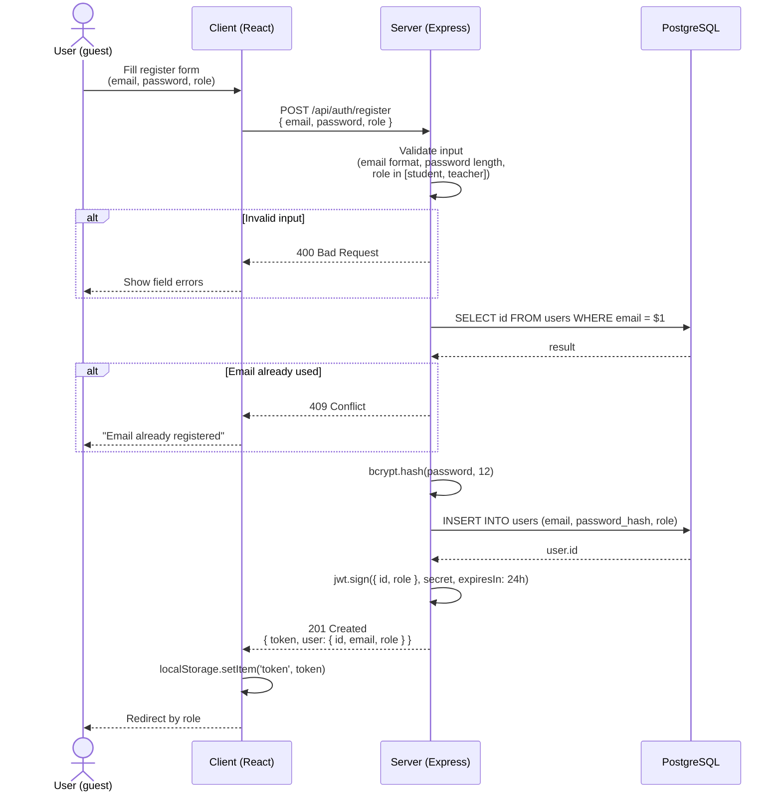
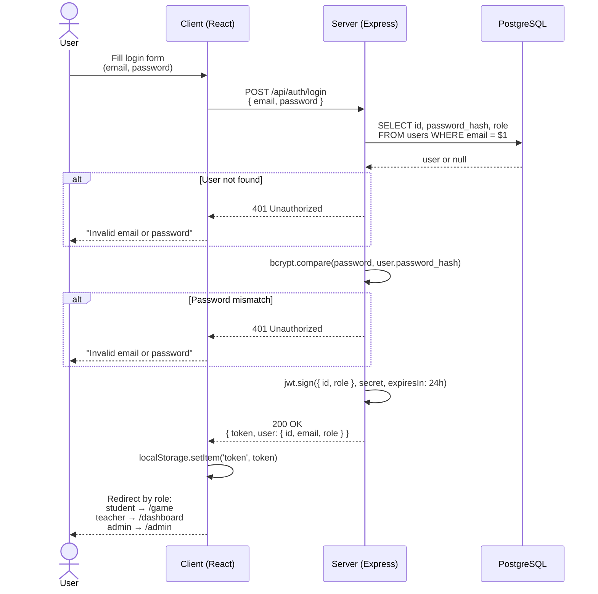
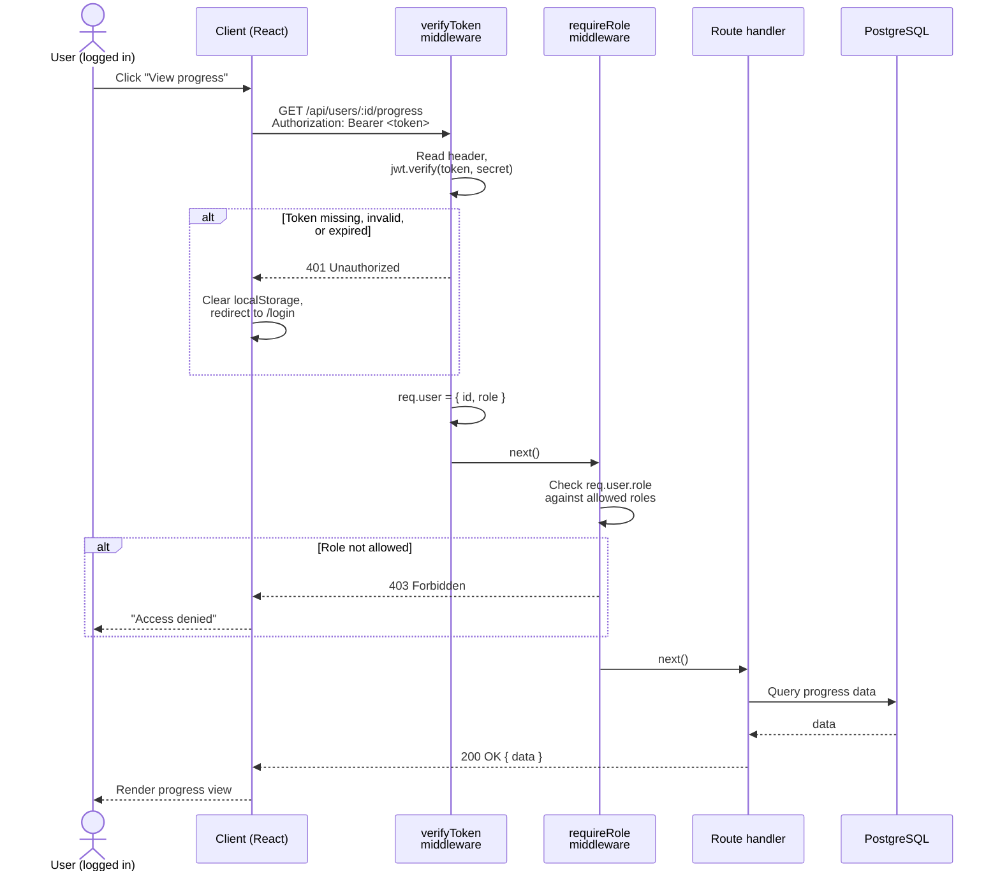

# CodeQuest — Authentication design

This document describes how auth works in CodeQuest: registration, login, and how protected routes check identity and role. It's the spec I'm coding from for phase 2.

## Design choices

A few decisions up front, leaning toward simplicity. This is a school project on an 11-week timeline, not a production banking app, so the goal is code I can explain line by line.

- **One JWT, no refresh token.** Tokens are valid for 24 hours; when yours expires, you log in again. A refresh mechanism would be nicer, but it brings real headaches: cookies across two deployment domains (Vercel on the front, Render on the back), rotation, server-side revocation. Not worth it for v1.
- **Access token stored in `localStorage` on the client.** That's less safe than memory-only or httpOnly cookies (XSS could read it), but React escapes everything by default and I avoid `dangerouslySetInnerHTML`. Acceptable trade-off for the MVP.
- **Bcrypt with 12 salt rounds.** Below 10 is too fast; above 14 noticeably slows registration. 12 is the usual sweet spot.
- **Role-based access via a middleware chain.** Every protected route runs `verifyToken` first to check identity, then `requireRole(...)` when a specific role is required. Two small middlewares, reusable everywhere.
- **At registration, role is restricted to `student` or `teacher`.** Admin accounts only come from the seed script. Letting anyone self-register as admin would be a non-starter.

## Endpoints

| Method | Path | Auth | Description |
|---|---|---|---|
| POST | `/api/auth/register` | Public | Create a student or teacher account |
| POST | `/api/auth/login` | Public | Authenticate and get a JWT |
| `*` | `/api/...` | Bearer JWT | Anything else, gated by `verifyToken` (and possibly `requireRole`) |

---

## 1. Registration

---

## 2. Login

The error message is the same whether the email is unknown or the password is wrong. Telling them apart would let someone enumerate which emails exist on the platform.

---

## 3. Access to a protected route

---

## Error responses

| Status | When |
|---|---|
| `400 Bad Request` | Malformed input (bad email, missing field, invalid role) |
| `401 Unauthorized` | Wrong credentials, missing token, or expired token |
| `403 Forbidden` | Logged in, but the role can't access this resource |
| `409 Conflict` | Email already registered (registration only) |

## Not covered yet

A few things are deliberately left out. Password reset will come in a later iteration if there's time. Rate limiting on the login endpoint and account lockout after repeated failures are easy to add with `express-rate-limit` later. Email verification at registration isn't planned for the MVP since schools tend to work with their own registration codes anyway.