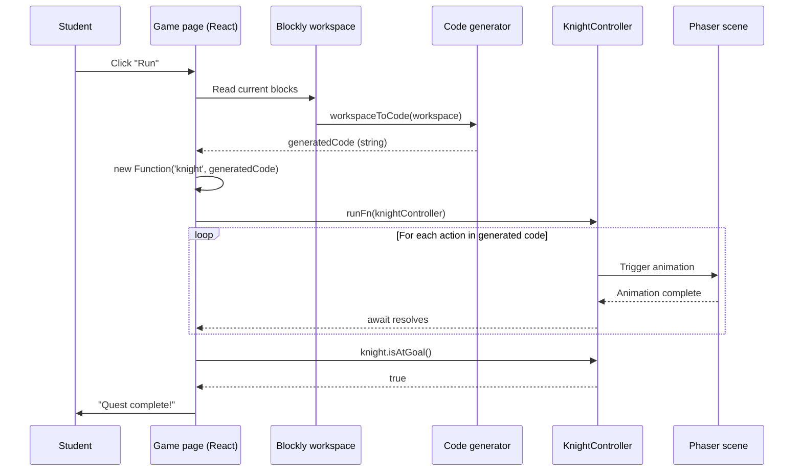

# Game Core Design

This document describes how the CodeQuest runtime works: how the Blockly visual editor, the generated code, and the Phaser game scene interact to let a student solve a quest by assembling blocks.

Written before implementation, in the same spirit as `AUTH_DESIGN.md`, so trade-offs are explicit and the implementation sprints have a clear contract to follow.

---

## 1. Goals and scope

The Phase 3 runtime must let a student:

- Open a quest, which loads a map, a starting position, and a goal.
- Assemble blocks from a toolbox restricted to that quest's allowed blocks.
- Click a "Run" button to execute the assembled program.
- See the knight character move, turn, attack, and interact with the world one action at a time, animated in Phaser.
- Be told whether the quest's goal has been reached.

Out of scope for Phase 3:

- Multi-knight or multiplayer scenarios.
- Custom user-created blocks (deferred to Phase 4).
- A real sandbox or interpreter with step-by-step debugging.
- Persistence of quest attempts (deferred until the dashboards consume it).
- Full boss fights with hit points, attack patterns, and knight death and respawn. Phase 3 only implements one-shot static enemies as a first step toward the boss system (see section 9).

---

## 2. Three-layer architecture

The runtime is split into three independent layers, each with a single responsibility and a stable interface with the next.

```
+-------------------+      +-------------------+      +-------------------+
|                   |      |                   |      |                   |
|  Blockly editor   | ---> |  Code generator   | ---> |  Phaser game      |
|  (visual blocks)  |      |  (JS string)      |      |  (knight moves)   |
|                   |      |                   |      |                   |
+-------------------+      +-------------------+      +-------------------+
        |                                                       ^
        |                                                       |
        +----- student clicks "Run" ----------------------------+
```

The Blockly editor renders the toolbox and the workspace. The toolbox is filtered per-quest, so a tutorial quest can hide advanced blocks.

The code generator is a Blockly-provided function that walks the block tree and produces a JavaScript string. Each block has a generator function attached to it.

The Phaser game renders the map, the knight, and the world. It does not know Blockly exists. It is driven by method calls on the `KnightController` exposed to the generated code.

---

## 3. Communication model: async commands

The generated code is an `async` JavaScript function. Each action the knight can perform is an `async` method that resolves only when its Phaser animation has finished.

Example of generated code from a 4-block program:

```javascript
async function run(knight) {
  await knight.moveForward()
  await knight.moveForward()
  if (knight.isEnemyAhead()) {
    await knight.attack()
  }
}
```

### Why this model

The code reads like real JavaScript, which is the platform's end goal. Students moving from Blockly to typed code will recognize the patterns. `await` serializes actions so the player sees them one at a time, with no manual frame counting or animation queues. The runtime itself is one line: a `new Function('knight', generatedCode)` call. No interpreter, no AST walking.

### Trade-offs accepted

There is no sandbox. The generated code runs in the main JS context, so a student could in principle reach `window` or `document`. For a classroom NSI platform this is fine; the threat model is curious students, not adversaries.

There is no step-by-step debugger. Execution cannot be paused between two `await`s to inspect knight state. A `JS-Interpreter` sandbox would allow this, at significantly more setup cost.

Infinite loops freeze the tab. If a student writes `while (true) {}` without an `await` inside, the browser hangs. We address this in Phase 4 by detecting suspicious patterns at generation time, or by wrapping `run()` in a timeout.

### Migration path to an interpreter

The interface between the generator and Phaser is a set of `async` methods on `KnightController`. If we ever migrate to `JS-Interpreter`, the blocks and their generators stay identical; only the function that executes the generated string changes. That isolation is the main reason we chose this approach over raw `eval` against Phaser methods directly.

---

## 4. KnightController: the public API exposed to student code

The generated code only ever interacts with one object: a `KnightController` instance. It is the only surface area exposed to student code.

```javascript
class KnightController {
  // Movement
  async moveForward()
  async turnLeft()
  async turnRight()

  // Combat
  async attack()

  // Sensors (synchronous, return immediately)
  isEnemyAhead()
  isWallAhead()
  isAtGoal()
}
```

### Why a dedicated class instead of exposing the Phaser scene directly

`KnightController` can be unit-tested with a fake scene that just records calls no Phaser boot needed. Blocks and generators depend only on this class, so if Phaser internals change (sprite name, animation key), the blocks don't break. Students also cannot reach `this.scene.scene.start()` or other Phaser internals through a Blockly block.

`KnightController` holds a reference to the Phaser scene and the knight sprite. Each async method:

1. Validates the action (e.g., refuses to move into a wall).
2. Triggers the appropriate Phaser tween or animation.
3. Returns a `Promise` that resolves when the animation completes.
4. Updates the internal knight position and orientation.

---

## 5. Movement model: grid-based

The knight moves on a tile grid, one cell at a time. A call to `knight.moveForward()` advances the knight by exactly one cell in the direction it is currently facing.

### Why grid-based

Pedagogical clarity, mostly. One block equals one action equals one cell. A student who places three "move forward" blocks expects the knight to advance three squares. Anything more nuanced (pixels, partial cells) breaks that mental model.

Collisions become trivial too. Walls and obstacles are tile properties on the map, so checking whether a move is legal is a single lookup in the tile array, not a continuous physics computation. Outcomes are also deterministic: from a given board state, a given block program always produces the same final position. That makes quests testable and grading reliable for the teacher dashboard.

It also costs very little to build. The grid is a plain 2D array, and Phaser renders each cell as a scaled sprite. No physics engine, no external map format.

### Visual smoothness within the grid

Grid-based does not mean teleporting. Each cell-to-cell move is animated by a Phaser tween over about 200ms, so the knight glides from one cell to the next. Discrete logic, smooth visuals.

### Trade-offs accepted

No diagonal movement in Phase 3. The knight faces and moves in one of four cardinal directions. If a quest design later needs diagonals, we add a `moveDiagonal()` method without touching the grid model.

No mid-cell state either. The knight cannot be halfway between cells when an enemy attacks. Combat resolution happens at cell boundaries.

### Migration path to free movement

If a future phase needs pixel-based movement, the change is localized to `KnightController`. Methods keep the same signatures but compute pixel-precise tweens internally; the map representation switches from a tile array to a navmesh. Blocks and generators are unaffected they only call `moveForward()` and never see coordinates directly.

---

## 6. Quest format

Quests are data, not code. A quest is a JSON document that fully describes the level. The game engine is generic.

```json
{
  "id": "quest_001",
  "title": "The long march",
  "description": "Move the knight to the flag.",
  "hint": "Le coffre ne viendra pas à toi. Regarde bien les murs.",
  "map": "field_1",
  "startPosition": { "x": 1, "y": 4, "facing": "right" },
  "goal": { "type": "reach", "x": 10, "y": 4 },
  "allowedBlocks": ["move_forward", "turn_left", "turn_right", "controls_repeat_ext"],
  "expectedSolution": { "minBlocks": 2 },
  "enemies": [],
  "goalTile": 0,
  "walls":      [[0, 0, 1, ...], ...],
  "floorTiles": [[0, 2, 0, ...], ...],
  "wallTiles":  [[0, 0, 3, ...], ...]
}
```

A few notes on the fields:

- `walls` is the binary collision grid: `walls[y][x] === 1` blocks the cell, everything else is walkable.
- `floorTiles`, `wallTiles`, and `goalTile` are optional sprite-index layers painted on top of the collision grid, decoupling appearance from collision. The same blocked cell can use any wall sprite without touching the `walls` matrix the `KnightController` reads. Tiles come from the Kenney sprite sets served under `client/public/sprites/`.
- `map` is a human-readable label only, not read by the engine yet. It's kept for when maps move to the database.
- `hint` is shown to the student and seeds the Phase 4 hint system.
- `enemies` lists static one-shot goblins for `defeat_all` quests.
- `allowedBlocks` filters the Blockly toolbox so the student only sees blocks relevant to this quest's learning objective.
- `goal.type` is an enum (`reach`, `defeat_all`, `collect`, ...); Phase 3 implements `reach` and `defeat_all` against static enemies, the others are scaffolded but unused.
- `expectedSolution.minBlocks` is used later by the dashboard to measure solution efficiency; it is not enforced at runtime.

For Phase 3, quests load from hardcoded JSON files in the client (`quest_001` through `quest_005`). Phase 4 will move them to the database and expose them through a `/api/quests` route.

---

## 7. Sequence diagram: student clicks Run



---

## 8. Folder layout

Phase 3 code lives under `client/src/game/` and `client/src/blockly/`, already stubbed from the Phase 1 scaffold.

```
client/src/
├── game/
│   ├── config.js              Phaser game configuration
│   ├── scenes/
│   │   └── QuestScene.js      Main scene: loads map, spawns knight
│   ├── KnightController.js    Public API consumed by generated code
│   ├── KnightController.test.js  Unit tests (fake scene, no Phaser boot)
│   ├── questLoader.js         Loads and lists the quest JSON files
│   ├── sound.js               Move/turn/attack/win sound effects
│   └── runner.js              AsyncFunction + execution wrapper
├── blockly/
│   ├── toolbox.js             Toolbox XML, filtered per-quest
│   ├── blocks/                Custom block definitions
│   │   ├── movement.js
│   │   └── sensors.js
│   └── generators/            Code generators per block
│       ├── movement.js
│       └── sensors.js
├── pages/
│   └── StudentDashboard.jsx   Hosts Phaser canvas + Blockly editor
└── quests/
    └── quest_001.json … quest_005.json   The five playable quests
```

---

## 9. Boss fights: incremental approach

Boss fights are part of CodeQuest's identity. Each major topic (Python, HTML/CSS, JavaScript, SQL) ends with a boss whose defeat requires combining that chapter's blocks. Because boss combat involves a lot of game-design work on top of the runtime, we split it across two phases.

### Phase 3: combat primitives

The runtime already exposes the building blocks for combat. `knight.attack()` triggers an attack animation in the direction the knight is facing. `knight.isEnemyAhead()` returns whether a hostile entity is in the adjacent cell. The `defeat_all` quest goal type is scaffolded for Phase 3 but only tested against static one-shot enemies goblins that die in one hit and don't retaliate.

This is enough to validate that the architecture handles enemies. The boss mechanics themselves come later.

### Phase 4: full boss system

Built on top of the Phase 3 primitives, Phase 4 adds what makes a real boss fight feel like one.

Both the knight and the boss get hit points, so the knight can die and the quest can fail, triggering a retry flow. Bosses follow attack patterns scripted or AI-driven ("move toward knight, telegraph attack, swing"). A `bosses` table, not in the schema yet, would hold one entry per chapter with a sprite, an HP pool, an attack pattern, and the blocks the student must use to win.

Three defeat conditions: time-out, knight dies, knight wins. Each outcome gets logged in the `attempts` table for the teacher dashboard. Visual polish on top: hit flashes, knockback, death animations, victory fanfare.

### Why this split

De-risking, mainly. By the end of Phase 3, the engine already handles combat at a basic level. Phase 4 is then about content and tuning, not architecture. If Phase 4 runs late, the project still has a demoable runtime.

It also reflects how game design actually works. Building one-shot enemies first exercises the `KnightController.attack()` API and surfaces its rough edges before scaling up to bosses with HP and patterns. Tuning HP values, attack speed, telegraph timings is more productive once the whole platform is playable end-to-end anyway.

---

## 10. Out of scope for Phase 3, addressed later

**Custom blocks** (students creating reusable mini-algorithms) are planned for Phase 4 alongside the teacher dashboard.

**Hint system** each quest JSON already carries a `hint` field, so the data is seeded. The reveal-after-N-failures UI is the only part left to build, also Phase 4.

**Block-to-code transitions**, where students write real JavaScript or Python in a text editor instead of blocks, are the platform's long-term goal and a separate phase entirely.