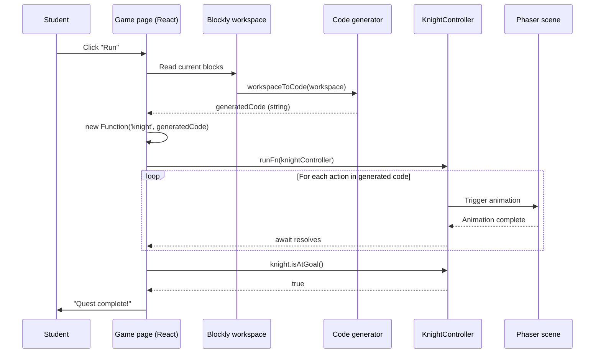

# Game Core Design

This document describes how the CodeQuest runtime works: how the Blockly visual editor, the generated code, and the Phaser game scene interact to let a student solve a quest by assembling blocks.

It is written before the implementation, in the same spirit as `AUTH_DESIGN.md`, so the trade-offs are explicit and the implementation sprints have a clear contract to follow.

---

## 1. Goals and scope

The Phase 3 runtime must let a student:

- Open a quest, which loads a map, a starting position, and a goal.
- Assemble blocks from a toolbox restricted to that quest's allowed blocks.
- Click a "Run" button to execute the assembled program.
- See the knight character move, turn, attack, and interact with the world one action at a time, animated in Phaser.
- Be told whether the quest's goal has been reached.

Out of scope for Phase 3:

- Multi-knight or multiplayer scenarios.
- Custom user-created blocks (deferred to Phase 4).
- A real sandbox or interpreter with step-by-step debugging.
- Persistence of quest attempts (deferred until the dashboards consume it).
- Full boss fights with hit points, attack patterns, and knight death and respawn. Phase 3 only implements one-shot static enemies as a first step toward the boss system (see section 9).

---

## 2. Three-layer architecture

The runtime is split into three independent layers. Each one has a single responsibility and a stable interface with the next.

```
+-------------------+      +-------------------+      +-------------------+
|                   |      |                   |      |                   |
|  Blockly editor   | ---> |  Code generator   | ---> |  Phaser game      |
|  (visual blocks)  |      |  (JS string)      |      |  (knight moves)   |
|                   |      |                   |      |                   |
+-------------------+      +-------------------+      +-------------------+
        |                                                       ^
        |                                                       |
        +----- student clicks "Run" ----------------------------+
```

The Blockly editor renders the toolbox and the workspace. The toolbox is filtered per-quest, so a tutorial quest can hide advanced blocks.

The code generator is a Blockly-provided function that walks the block tree and produces a JavaScript string. Each block has a generator function attached to it.

The Phaser game renders the map, the knight, and the world. It does not know Blockly exists. It is driven by method calls on the `KnightController` that we expose to the generated code.

---

## 3. Communication model: async commands

The generated code is an `async` JavaScript function. Each action the knight can perform is an `async` method that resolves only when its Phaser animation has finished.

Example of generated code from a 4-block program:

```javascript
async function run(knight) {
  await knight.moveForward()
  await knight.moveForward()
  if (knight.isEnemyAhead()) {
    await knight.attack()
  }
}
```

### Why this model

The code reads like real JavaScript, which is the platform's end goal. Students moving from Blockly to typed code will recognize the patterns. `await` serializes actions so the player sees them one at a time, with no manual frame counting or animation queues. And the runtime itself is one line: a `new Function('knight', generatedCode)` call. No interpreter, no AST walking.

### Trade-offs accepted

There is no sandbox. The generated code runs in the main JS context, so a student could in principle reach `window` or `document`. For a classroom NSI platform this is fine; the threat model is curious students, not adversaries.

There is no step-by-step debugger either. Execution cannot be paused between two `await`s to inspect knight state. A `JS-Interpreter` sandbox would allow this, at the cost of significantly more setup.

Infinite loops freeze the tab. If a student writes `while (true) {}` without an `await` inside, the browser hangs. We address this in Phase 4 by detecting suspicious patterns at generation time, or by adding a timeout wrapper around `run()`.

### Migration path to an interpreter

The interface between the generator and Phaser is a set of `async` methods on `KnightController`. If we ever migrate to `JS-Interpreter`, the blocks and their generators stay identical; only the function that executes the generated string changes. That isolation is the main reason we chose this approach over raw `eval` against Phaser methods directly.

---

## 4. KnightController: the public API exposed to student code

The generated code only ever interacts with one object: a `KnightController` instance. It is the only surface area exposed to student code.

```javascript
class KnightController {
  // Movement
  async moveForward()
  async turnLeft()
  async turnRight()

  // Combat
  async attack()

  // Sensors (synchronous, return immediately)
  isEnemyAhead()
  isWallAhead()
  isAtGoal()
}
```

### Why a dedicated class instead of exposing the Phaser scene directly

`KnightController` can be unit-tested with a fake scene that just records calls, so we don't need to boot Phaser in tests. Blocks and their generators depend only on this class, which means if Phaser internals change (sprite name, animation key), the blocks don't break. Students also cannot reach `this.scene.scene.start()` or other Phaser internals by typing into a Blockly block.

`KnightController` holds a reference to the Phaser scene and the knight sprite. Each async method:

1. Validates the action (e.g., refuses to move into a wall).
2. Triggers the appropriate Phaser tween or animation.
3. Returns a `Promise` that resolves when the animation completes.
4. Updates the internal knight position and orientation.

---

## 5. Movement model: grid-based

The knight moves on a tile grid, one cell at a time. A call to `knight.moveForward()` advances the knight by exactly one cell in the direction it is currently facing.

### Why grid-based

The main reason is pedagogical clarity. One block equals one action equals one cell. A student who places three "move forward" blocks expects the knight to advance three squares. Anything more nuanced (pixels, partial cells) breaks the mental model.

Collisions also become trivial. Walls and obstacles are tile properties on the map, so checking whether a move is legal is a single lookup in the tile array, not a continuous physics computation. Outcomes are deterministic too: from a given board state, a given block program always produces the same final position. That makes quests testable and grading reliable for the teacher dashboard later on.

And it costs us very little to build. Phaser supports tile-based maps natively via Tiled-format tilemaps. No physics engine needed.

### Visual smoothness within the grid

Grid-based does not mean teleporting. Each cell-to-cell move is animated by a Phaser tween over about 200ms, so the knight glides smoothly from one cell to the next. The student sees fluid motion while the underlying logic stays discrete.

### Trade-offs accepted

No diagonal movement in Phase 3. The knight faces and moves in one of four cardinal directions. If a quest design later requires diagonals, we add a `moveDiagonal()` method without changing the grid model.

No "almost there" interactions either. The knight cannot be halfway between cells when an enemy attacks. Combat resolution happens at cell boundaries.

### Migration path to free movement

If a future phase needs free pixel-based movement (e.g., an open-world exploration mode), the change is localized. `KnightController` methods keep the same signatures but compute pixel-precise tweens internally, and the map representation switches from a tile array to a navmesh. Blocks and generators are not affected, because they only call `moveForward()` and friends; they never see coordinates directly.

---

## 6. Quest format

Quests are data, not code. A quest is a JSON document that fully describes the level. The game engine itself is generic.

```json
{
  "id": "quest_001",
  "title": "First steps",
  "description": "Move the knight to the chest.",
  "map": "tutorial_1",
  "startPosition": { "x": 1, "y": 1, "facing": "right" },
  "goal": { "type": "reach", "x": 5, "y": 1 },
  "allowedBlocks": ["move_forward", "turn_right"],
  "expectedSolution": { "minBlocks": 4 }
}
```

A few notes on the fields. `map` references a tile-based map loaded by Phaser; maps are static assets in `client/public/maps/`. `allowedBlocks` filters the Blockly toolbox so the student only sees the blocks relevant to this quest's learning objective. `goal.type` is an enum (`reach`, `defeat_all`, `collect`, ...) and Phase 3 only implements `reach`; the others are scaffolded but unused. `expectedSolution.minBlocks` is used later by the dashboard to measure how efficient the student's solution was; it is not enforced at runtime.

For Phase 3, quests are loaded from a hardcoded JSON file in the client. Phase 4 will move them to the database and expose them through the existing `/api/quests` route.

---

## 7. Sequence diagram: student clicks Run



---

## 8. Folder layout

The Phase 3 code lives under `client/src/game/` and `client/src/blockly/`, which already exist as stubs from the Phase 1 scaffold.

```
client/src/
├── game/
│   ├── config.js              Phaser game configuration
│   ├── scenes/
│   │   └── QuestScene.js      Main scene: loads map, spawns knight
│   ├── KnightController.js    Public API consumed by generated code
│   └── runner.js              new Function() + execution wrapper
├── blockly/
│   ├── toolbox.js             Toolbox XML, filtered per-quest
│   ├── blocks/                Custom block definitions
│   │   ├── movement.js
│   │   └── sensors.js
│   └── generators/            Code generators per block
│       ├── movement.js
│       └── sensors.js
├── pages/
│   └── StudentDashboard.jsx   Hosts Phaser canvas + Blockly editor
└── quests/
    └── quest_001.json         First playable quest
```

---

## 9. Boss fights: incremental approach

Boss fights are part of CodeQuest's identity. Each major topic (Python, HTML/CSS, JavaScript, SQL) ends with a boss whose defeat requires combining that chapter's blocks. Because boss combat involves a lot of game-design work on top of the runtime, we split it across two phases.

### Phase 3: combat primitives

The runtime already exposes the building blocks for combat. `knight.attack()` triggers an attack animation in the direction the knight is facing. `knight.isEnemyAhead()` returns whether a hostile entity is in the adjacent cell. A new quest goal type `defeat_all` is scaffolded but is only validated in Phase 3 against static one-shot enemies, like a goblin that dies in one hit and does not retaliate.

That is enough to prove the architecture handles enemies without locking us into specific boss mechanics yet.

### Phase 4: full boss system

Built on top of the Phase 3 primitives, Phase 4 adds the parts that make a real boss fight feel like one.

Both the knight and the boss have hit points, so the knight can die and the quest can fail. That triggers a retry flow. Bosses follow attack patterns, either scripted or AI-driven, like "move toward knight, telegraph attack, swing". The existing `bosses` table is populated with one entry per chapter, each referencing a sprite, an HP pool, an attack pattern, and the blocks the student must use to win.

Three defeat conditions are handled: time-out, knight dies, knight wins. Each outcome is logged through `quest_progress` so the teacher dashboard can show it. On top of all that comes visual polish: hit flashes, knockback, death animations, victory fanfare.

### Why this split

The main reason is de-risking. By the end of Phase 3, the engine can already handle combat at a basic level. Phase 4 is then about content and tuning, not architecture. If Phase 4 runs late, the project still has a demoable runtime.

The split also reflects an iterative design choice. Building one-shot enemies first forces us to exercise the `KnightController.attack()` API and find its rough edges before scaling up to bosses with HP and patterns. And practically speaking, a real boss fight is mostly tuning work (HP values, attack speed, telegraph timings). That kind of work is more productive once the whole platform is playable end-to-end, not during the engine build itself.

---

## 10. Out of scope for Phase 3, addressed later

Custom blocks, where students create reusable mini-algorithms, are planned for Phase 4 alongside the teacher dashboard. Persistence of attempts will come at the same time: the `quest_progress` table exists in the schema but is not written to in Phase 3.

A hint system, where per-quest hints are exposed to the student after N failed attempts, is also planned for Phase 4.

Block-to-code transitions, where students write real JavaScript or Python in a text editor instead of blocks, are the platform's long-term goal and a separate phase entirely.