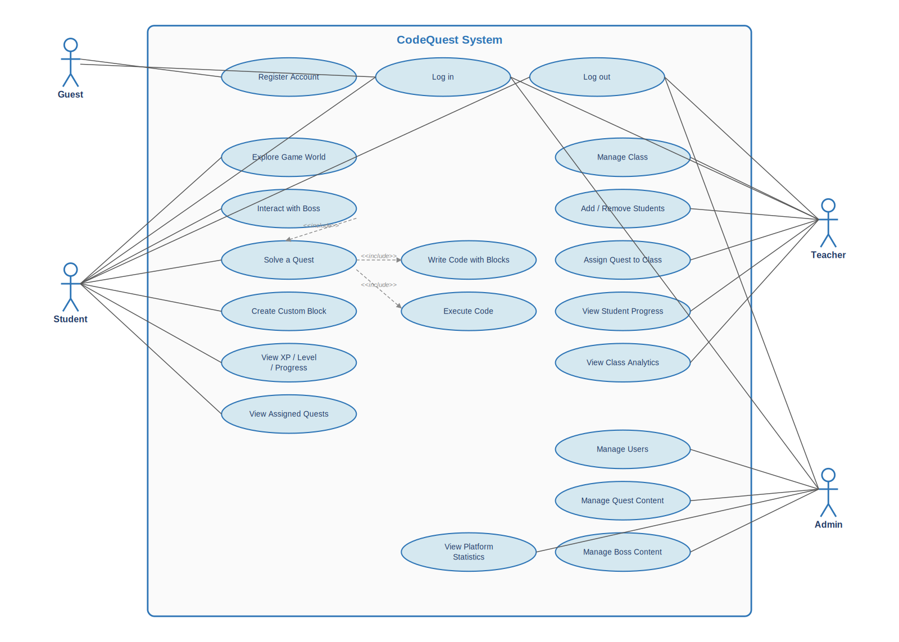
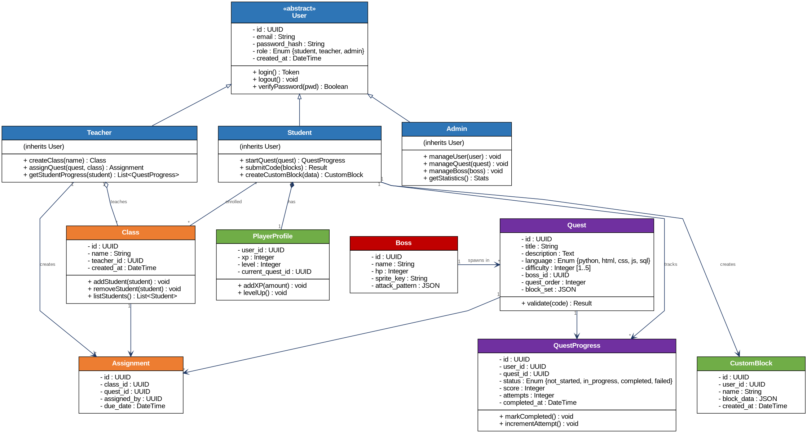

# CodeQuest — Requirements Analysis and UML Modelling

> A gamified web platform to teach programming to French NSI high school students.
>
> **Author:** Maxime · **Date:** April 2026

---

## Table of Contents

1. [Introduction](#1-introduction)
2. [System Actors](#2-system-actors)
3. [Functional Requirements](#3-functional-requirements)
4. [Non-Functional Requirements](#4-non-functional-requirements)
5. [Use Case Diagram](#5-use-case-diagram)
6. [Class Diagram](#6-class-diagram)
7. [Conclusion](#7-conclusion)

---

## 1. Introduction

This document presents the requirements analysis and the UML modelling for **CodeQuest**, an educational web platform designed to teach programming to French high school students enrolled in the NSI (*Numérique et Sciences Informatiques*) curriculum. The platform takes the form of a pixel art MMORPG-inspired world where students control a knight character, fight bosses, and solve quests using a visual block-based programming editor powered by Google Blockly.

The goal of this document is twofold: first, to identify the actors who interact with the system and formalize the functional and non-functional requirements that the platform must satisfy; second, to provide a high-level UML view of the system through a use case diagram and a class diagram, both of which will guide the implementation phase.

The scope covered here reflects the current state of the project as of April 2026. Some requirements and model elements may evolve during development, as new use cases are discovered or the design is refined.

---

## 2. System Actors

Four distinct actors interact with CodeQuest. Each one corresponds to a specific role in the platform and has a dedicated interface adapted to their needs.

### 2.1 Guest

An unauthenticated visitor accessing the platform for the first time. A Guest can create a new account or log in with existing credentials, but cannot access any protected feature until authenticated. Once logged in, the Guest becomes one of the three authenticated roles below.

### 2.2 Student

The main user of the platform and the primary target audience. A Student is typically a high school student with little to no prior programming experience. Students interact with the platform through the game interface: they explore the pixel art world, engage with bosses, solve quests using the visual block editor, and progressively learn the core languages of the NSI curriculum (Python, HTML, CSS, JavaScript, and SQL). They can track their progression through XP, levels, and completed quests.

### 2.3 Teacher

The NSI teacher in charge of one or several classes. A Teacher uses the platform to manage their students, assign specific quests with due dates, and monitor progress both at the individual and class level. The Teacher interface is built around a dashboard view that surfaces completion rates, scores, and attempts — allowing the teacher to spot students who are struggling or who have already mastered a topic.

### 2.4 Admin

The platform administrator responsible for maintaining the content and the user base. An Admin has full access to the platform: they can manage users (creation, edition, deletion), curate quest and boss content, and consult global usage statistics. Admin access is restricted through role-based access control enforced on every protected endpoint of the backend.

---

## 3. Functional Requirements

Functional requirements describe what the system must do — the concrete features and behaviours it must support. They are grouped below by subsystem for clarity.

### 3.1 Authentication and User Management

- **FR-A1 — Registration:** The system shall allow a Guest to register an account by providing an email, a password, and a role (student or teacher by default; admin accounts are created internally).
- **FR-A2 — Authentication:** The system shall authenticate users with a JWT token issued after successful login.
- **FR-A3 — Role-based access:** The system shall enforce role-based access control, restricting each endpoint to the appropriate role(s).
- **FR-A4 — Logout:** Authenticated users shall be able to log out, invalidating their current session on the client side.
- **FR-A5 — Password security:** Passwords shall be stored in the database only as bcrypt hashes, never in plain text.

### 3.2 Student — Gameplay and Learning

- **FR-S1 — Explore the game world:** A Student shall be able to navigate a pixel art map controlling a knight character.
- **FR-S2 — Interact with bosses:** A Student shall be able to approach a boss and initiate a quest linked to it.
- **FR-S3 — Solve quests via Blockly:** A Student shall be able to assemble blocks in the Google Blockly editor to solve a quest challenge.
- **FR-S4 — Execute code:** A Student shall be able to run their assembled blocks; the system shall execute the corresponding code and return the result.
- **FR-S5 — Validate quest completion:** The system shall validate the Student's submission against the quest's expected outcome and mark the quest as completed or failed accordingly.
- **FR-S6 — Record attempts:** The system shall record every quest attempt, its score, and its completion status.
- **FR-S7 — Create custom blocks:** A Student shall be able to compose their own reusable blocks from existing ones, and save them for later use.
- **FR-S8 — Track progression:** A Student shall be able to consult their XP, level, and completed quests on their profile.
- **FR-S9 — View assigned quests:** A Student shall be able to view the list of quests assigned by their teacher, along with their due dates.

### 3.3 Teacher — Classroom Management and Monitoring

- **FR-T1 — Manage classes:** A Teacher shall be able to create, edit, and delete the classes they own.
- **FR-T2 — Manage students in a class:** A Teacher shall be able to add and remove students from their own classes.
- **FR-T3 — Assign quests:** A Teacher shall be able to assign one or several quests to a class, optionally specifying a due date.
- **FR-T4 — Monitor individual progress:** A Teacher shall be able to consult any student's progression (XP, level, quests completed, scores, attempts).
- **FR-T5 — View class analytics:** A Teacher shall be able to view class-wide statistics (completion rates, average scores, active students).

### 3.4 Admin — Platform Management

- **FR-AD1 — Manage users:** An Admin shall be able to create, edit, and delete users of any role.
- **FR-AD2 — Manage quest content:** An Admin shall be able to create, edit, and delete quests, including their language, difficulty, block set, and associated boss.
- **FR-AD3 — Manage boss content:** An Admin shall be able to create, edit, and delete bosses, including their sprite, HP, and attack pattern.
- **FR-AD4 — View platform statistics:** An Admin shall be able to consult global statistics about platform usage (number of users per role, quests completed, etc.).

---

## 4. Non-Functional Requirements

Non-functional requirements describe how the system should behave — the quality attributes it must exhibit beyond its raw features.

| Category | ID | Requirement |
|---|---|---|
| Usability | NFR-U1 | The student interface shall be intuitive for beginners with no programming experience, relying on visual feedback and drag-and-drop interaction. |
| Usability | NFR-U2 | The platform shall support French as its primary language; English may be added later. |
| Usability | NFR-U3 | Error messages shall be written in plain language and shall guide the user toward a solution. |
| Performance | NFR-P1 | Page load time on the student game interface shall remain below 3 seconds on a standard broadband connection. |
| Performance | NFR-P2 | Feedback after code execution shall be returned to the student in under 2 seconds in nominal conditions. |
| Performance | NFR-P3 | The backend shall support at least 30 concurrent students per class without noticeable degradation. |
| Security | NFR-S1 | All passwords shall be hashed with bcrypt before storage. |
| Security | NFR-S2 | Authentication shall rely on signed JWT tokens with a reasonable expiration window. |
| Security | NFR-S3 | Role-based access control shall be enforced on every protected endpoint. |
| Security | NFR-S4 | All communications between client and server shall use HTTPS in production. |
| Security | NFR-S5 | Student data shall be handled in compliance with GDPR, including the right to erasure. |
| Reliability | NFR-R1 | The platform shall handle unexpected errors gracefully, without exposing stack traces to the end user. |
| Reliability | NFR-R2 | The database shall be backed up at least once a day. |
| Maintainability | NFR-M1 | The codebase shall follow conventional style rules enforced by ESLint and Prettier. |
| Maintainability | NFR-M2 | Backend and frontend shall be organized in modular folders (routes / controllers / models / components / pages / hooks). |
| Maintainability | NFR-M3 | The project shall include a CI pipeline (GitHub Actions) running tests and builds on every pull request. |
| Maintainability | NFR-M4 | Every public API endpoint shall be documented in the README. |
| Portability | NFR-PO1 | The web client shall run correctly on recent versions of Chrome, Firefox, Safari, and Edge. |
| Portability | NFR-PO2 | The whole stack shall be containerized with Docker to allow a single-command local setup (`docker-compose up`). |
| Portability | NFR-PO3 | The production deployment shall target Vercel for the frontend and Render for the backend. |

---

## 5. Use Case Diagram

The diagram below summarizes the interactions between the four actors and the CodeQuest system. Dashed arrows labelled `<<include>>` indicate that one use case always involves the execution of another (for instance, *Solve a Quest* always includes *Write Code with Blocks* and *Execute Code*).

Mermaid does not natively support UML use case diagrams, so the flowchart below approximates one — actors are shown as rectangles on the edges, use cases as stadium-shaped nodes inside the system boundary.

---

## 6. Class Diagram

The model is built around an abstract `User` class from which `Student`, `Teacher`, and `Admin` inherit. Each entity below corresponds to a dedicated table in the PostgreSQL schema, with the exception of `ClassStudent` and `Assignment` which materialize many-to-many relationships.

### 6.1 Key relationships

- `User` is an abstract class; `Student`, `Teacher`, and `Admin` specialize it through generalization.
- A `Student` owns exactly one `PlayerProfile` (composition) and may create multiple `CustomBlock`s.
- A `Teacher` teaches zero or more `Class`es, and each `Class` enrolls zero or more `Student`s (many-to-many, materialized by the `ClassStudent` join table in the database).
- An `Assignment` is the intermediary between a `Class`, a `Quest`, and the `Teacher` who assigned it, with an optional due date.
- A `Boss` spawns in zero or more `Quest`s; each `Quest` has exactly one `Boss`.
- `QuestProgress` records the relationship between a `Student` and a `Quest`, including the current status (`not_started`, `in_progress`, `completed`, `failed`), the score, and the number of attempts.

---

## 7. Conclusion

This requirements analysis provides a structured view of what CodeQuest must do, how it should behave, and how its components relate to each other. The functional requirements cover the three main user journeys (student gameplay, teacher management, admin administration) on top of a shared authentication layer. The non-functional requirements define the quality bar — especially usability for beginners and security around student data — that the implementation must meet.

The UML diagrams align with the existing project architecture: the class diagram mirrors the eight tables of the PostgreSQL schema already in place, and the use case diagram reflects the three interfaces (student, teacher, admin) that the project is structured around. Both models will be refined as development progresses and as new edge cases are discovered during implementation.
