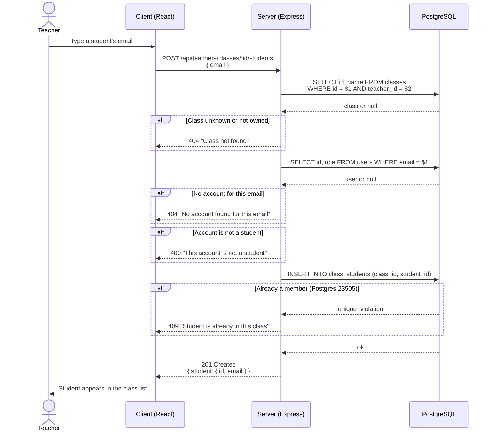

# Teacher backend design

This document describes the teacher side of the API: how a teacher creates classes, puts students in them, and reads a class's progress. It covers FR-T1, FR-T2, and the backend half of FR-T4. The React dashboard that will consume these routes is a separate sprint; this is the contract it gets built against.

Same habit as `AUTH_DESIGN.md` and `GAME_DESIGN.md`: design first, code second, trade-offs in writing.

One structural note up front. The `classes` and `class_students` tables have existed in `database/schema.sql` since Phase 1, with their indexes and their `ON DELETE CASCADE` rules. This module needs no migration. Everything below is application code.

## Design choices

- **Ownership is checked on every query, and a miss returns 404.** The teacher id comes from `req.user.id`. Every route with a `:id` starts with `SELECT ... WHERE id = $1 AND teacher_id = $2`. If nothing comes back, the answer is 404, whether the class is missing or simply belongs to another teacher. A 403 would confirm that the class exists under someone else's account; a 404 gives that away. It is the resource-level twin of the single 401 message on login.
- **Students are added by email.** Teachers know their students' emails, not their database ids. The endpoint returns three different errors: no such account, account is not a student, student already in the class. Those distinct messages turn the endpoint into an enumeration oracle, which I argue through in section 1 rather than leaving it implicit.
- **Class progress is one SQL query.** No per-student loop. A `LEFT JOIN` keeps students who have zero attempts. The query is in section 2.
- **Duplicates are caught by the constraint.** `class_students` has a composite primary key on `(class_id, student_id)`, so the insert can fail with Postgres `23505` and we turn that into a 409. Registration already handles duplicate emails the same way.
- **SQL stays in models.** A new `Class.js` (create, findByTeacher, findByIdAndTeacher, addStudent, removeStudent) and one function added to `Attempt.js` (summaryByClass). The email lookup reuses `User.findByEmail`, which returns `password_hash` because login needs it, so the controller forwards only `id` and `email`.

## Endpoints

All five routes run `verifyToken` then `requireRole('teacher')`, mounted at `/api/teachers`. This finally puts content in `routes/teachers.js`, empty since April, and uncomments its line in `index.js`.

| Method | Path | Description |
|---|---|---|
| POST | `/api/teachers/classes` | Create a class. Body: `{ name }` |
| GET | `/api/teachers/classes` | List own classes, with student counts |
| POST | `/api/teachers/classes/:id/students` | Add a student by email. Body: `{ email }` |
| DELETE | `/api/teachers/classes/:id/students/:studentId` | Remove a student from the class |
| GET | `/api/teachers/classes/:id/progress` | Aggregated progress, one entry per student |

Success responses: `201 { class }` on creation, `200 { classes }` on listing, `201 { student: { id, email } }` on adding, `204` with no body on removal, and `200` with the shape described in section 2 for progress.

---

## 1. Adding a student by email



The 404 body for a class that exists but belongs to someone else is byte-for-byte the same as for an id that does not exist at all. A test checks this (TC-MEM-08).

Distinct error messages have a cost, and that cost needs an argument. Any teacher account can submit an email here and find out whether it belongs to someone on the platform. We shut this exact door on login, where an unknown email and a wrong password return one identical 401.

Login is anonymous, though, and this caller is not: they hold a teacher token tied to an account id, behind a role check. They are also a teacher typing thirty addresses to set up a class. Collapse the three errors into one and a typo, a colleague's email pasted by accident, and a genuine duplicate all look the same, with no way to repair the list except guesswork.

I weighed the safe variant, a single generic 404, and turned it down. The honest caveat: registration is open, so anyone can spin up a teacher account and probe this oracle. The fix is school registration codes at signup, already on the future-work list in `AUTH_DESIGN.md`. Once accounts are vetted, the only people seeing these messages are the ones whose job is managing student lists.

---

## 2. Class progress aggregation

One query feeds the whole progress view:

```sql
SELECT u.id AS student_id, u.email,
       a.quest_id,
       bool_or(a.completed) AS completed,
       COUNT(a.id)::int     AS attempts,
       MAX(a.score)::int    AS best_score
FROM class_students cs
JOIN users u         ON u.id = cs.student_id
LEFT JOIN attempts a ON a.student_id = u.id
WHERE cs.class_id = $1
GROUP BY u.id, u.email, a.quest_id
ORDER BY u.email, a.quest_id
```

Three details matter here:

- The query starts from membership rather than from attempts. The `LEFT JOIN` keeps a student who never played: they come back as a single row with a `NULL` quest_id. That row is what tells the teacher who has not started yet.
- `COUNT(a.id)`, not `COUNT(*)`. On the `NULL` row of an inactive student, `COUNT(*)` would report one phantom attempt; `COUNT(a.id)` correctly says zero.
- The `::int` casts are there for the same reason as in `summaryByStudent`: Postgres aggregates come back as bigint, which `pg` serializes as strings in JSON.

The controller folds these flat rows into one entry per student. A `NULL` quest_id becomes an empty `quests` array:

```json
{
  "class": { "id": 3, "name": "1ere NSI A" },
  "students": [
    {
      "id": 12,
      "email": "alice@school.fr",
      "quests": [
        { "quest_id": "quest_001", "completed": true, "attempts": 3, "best_score": 0 }
      ]
    },
    { "id": 15, "email": "bob@school.fr", "quests": [] }
  ]
}
```

This shape maps directly onto the dashboard table of the next sprint: rows come from `students`, columns from the `listQuests()` the client already has.

A note on the listing endpoint while we are in SQL: `GET /classes` does a small `LEFT JOIN` on `class_students` with `COUNT(cs.student_id)::int AS student_count`, so a brand-new class reports zero students instead of nothing. No other query in this module is worth writing out.

---

## Validation rules

Same spirit as the auth module: validate before touching the database, reject with a clean 400 instead of letting Postgres throw.

- `name`: must be a string, trimmed, 1 to 100 characters. The upper bound matches the `VARCHAR(100)` column.
- `email`: must be a string, trimmed and lowercased, the same normalization as auth, so `ALICE@X.COM` finds the account stored as `alice@x.com`.
- `:id` and `:studentId` URL params: digits only, parsed to a positive integer, otherwise 400 before any query. Postgres would error on `abc` against an integer column; refusing earlier gives a clear message instead of a 500.

## Error responses

| Status | When |
|---|---|
| `400 Bad Request` | Malformed name or email, non-integer id in the URL, or the account is not a student |
| `401 Unauthorized` | Missing, invalid, or expired token |
| `403 Forbidden` | Valid token, but the role is not teacher |
| `404 Not Found` | Class unknown or owned by another teacher; no account for this email; student not in the class on removal |
| `409 Conflict` | Student already in the class |

## Not covered yet

Renaming and deleting classes are left out. The cascade rules already sit in the schema, so either one becomes a single short route the day it is needed. FR-T3 (assigning quests to a class) and FR-T5 (class-level analytics) stay in the Should bucket from `PRIORITIZATION.md`. The progress endpoint returns aggregates only; a per-attempt history for one student can come later without changing this contract. No pagination either: an NSI class runs about thirty students, and a flat list holds up fine at that size.

---

## Test plan

Same harness as `TEST_PLAN.md`: Jest and Supertest against the real `codequest_test` database, `.env.test`, truncation in `beforeEach`. One detail makes this free: `TRUNCATE TABLE users RESTART IDENTITY CASCADE` already cascades through `classes`, `class_students`, and `attempts`, so the existing helper isolates these tests without any change. Each test creates its own teachers and students through the real `/api/auth/register` endpoint, like `students.test.js` does.

Files: `tests/teacher-classes.test.js`, `tests/teacher-members.test.js`, `tests/teacher-progress.test.js`. Category codes reuse `TEST_PLAN.md` section 4.

### Classes: create and list

| ID | Cat | Scenario | Input | Expected status | Expected body | Status |
|---|---|---|---|---|---|---|
| TC-CLS-01 | HP | Teacher creates a class | `{ name: "1ere NSI A" }` | 201 | `{ class: { id, name, created_at } }`, row in DB | planned |
| TC-CLS-02 | IV | Missing name | `{}` | 400 | `error: "name is required"` | planned |
| TC-CLS-03 | IV | Name is a number | `{ name: 42 }` | 400 | same | planned |
| TC-CLS-04 | EC | Whitespace-only name | `{ name: "   " }` | 400 | `error: "name cannot be empty"` | planned |
| TC-CLS-05 | EC | Name trimmed in storage | `{ name: "  1ere NSI A  " }` | 201 | stored as `"1ere NSI A"` | planned |
| TC-CLS-06 | IV | Name too long (101 chars) | `{ name: "a".repeat(101) }` | 400 | `error: "name cannot exceed 100 characters"` | planned |
| TC-CLS-07 | SEC | No token | POST without Authorization header | 401 | `error: "Access token required"` | planned |
| TC-CLS-08 | SEC | Student token on POST | valid student JWT | 403 | `error: "Insufficient permissions"` | planned |
| TC-CLS-09 | HP | List own classes with counts | two classes, one with a student | 200 | `{ classes }` with `student_count` 1 and 0 | planned |
| TC-CLS-10 | SEC | Listing is scoped to the owner | teacher A creates, teacher B lists | 200 | empty array for B | planned |

### Class members: add and remove

| ID | Cat | Scenario | Input | Expected status | Expected body | Status |
|---|---|---|---|---|---|---|
| TC-MEM-01 | HP | Add a student by email | `{ email }` of a student account | 201 | `{ student: { id, email } }`, link row in DB | planned |
| TC-MEM-02 | IV | Missing email | `{}` | 400 | `error: "email is required"` | planned |
| TC-MEM-03 | IV | Email is a number | `{ email: 123 }` | 400 | same | planned |
| TC-MEM-04 | EC | Email normalized before lookup | `{ email: "ALICE@TEST.COM" }` for account `alice@test.com` | 201 | student added | planned |
| TC-MEM-05 | EC | Unknown email | `{ email: "ghost@test.com" }` | 404 | `error: "No account found for this email"` | planned |
| TC-MEM-06 | EC | Email belongs to a teacher | another teacher's email | 400 | `error: "This account is not a student"` | planned |
| TC-MEM-07 | EC | Already in the class | same add twice | 409 | `error: "Student is already in this class"` | planned |
| TC-MEM-08 | SEC | Another teacher's class | teacher B posts to A's class id | 404 | byte-for-byte same body as an unknown id | planned |
| TC-MEM-09 | SEC | Student token | valid student JWT | 403 | `error: "Insufficient permissions"` | planned |
| TC-MEM-10 | IV | Non-integer class id | `POST /classes/abc/students` | 400 | `error: "Invalid class id"` | planned |
| TC-MEM-11 | HP | Remove a student | DELETE with linked student | 204 | empty body, link row gone | planned |
| TC-MEM-12 | EC | Remove a non-member | DELETE for a student not in the class | 404 | `error: "Student is not in this class"` | planned |
| TC-MEM-13 | SEC | Remove from another teacher's class | teacher B deletes in A's class | 404 | `error: "Class not found"` | planned |
| TC-MEM-14 | EC | Removal keeps the history | remove a student who has attempts | 204 | `attempts` rows still in DB | planned |

### Class progress

| ID | Cat | Scenario | Input | Expected status | Expected body | Status |
|---|---|---|---|---|---|---|
| TC-CPROG-01 | HP | Aggregated progress | class with two students and attempts | 200 | `{ class, students }` per the section 2 shape | planned |
| TC-CPROG-02 | EC | Zero-attempt student still listed | one member never played | 200 | their entry has `quests: []` | planned |
| TC-CPROG-03 | EC | Aggregation across attempts | one student fails then wins quest_001 | 200 | `completed: true, attempts: 2`, best_score is the max | planned |
| TC-CPROG-04 | EC | Non-members stay out | a student outside the class has attempts | 200 | their data absent from the response | planned |
| TC-CPROG-05 | EC | Empty class | class with no students | 200 | `students: []` | planned |
| TC-CPROG-06 | SEC | Another teacher's class | teacher B reads A's class progress | 404 | `error: "Class not found"` | planned |
| TC-CPROG-07 | SEC | Student token | valid student JWT | 403 | `error: "Insufficient permissions"` | planned |
| TC-CPROG-08 | IV | Non-integer id | `GET /classes/abc/progress` | 400 | `error: "Invalid class id"` | planned |
| TC-CPROG-09 | EC | Unknown class id | `GET /classes/99999/progress` | 404 | `error: "Class not found"` | planned |